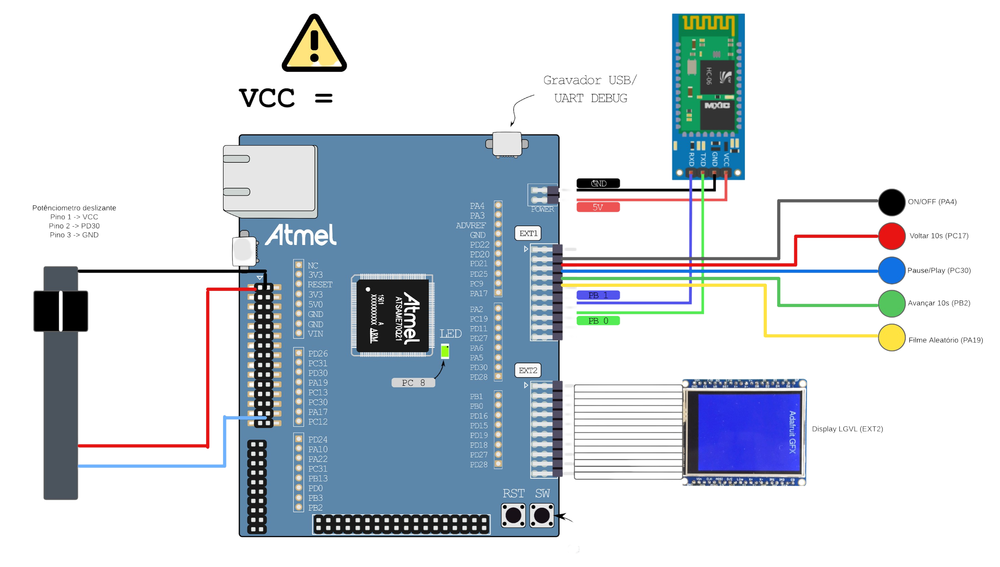
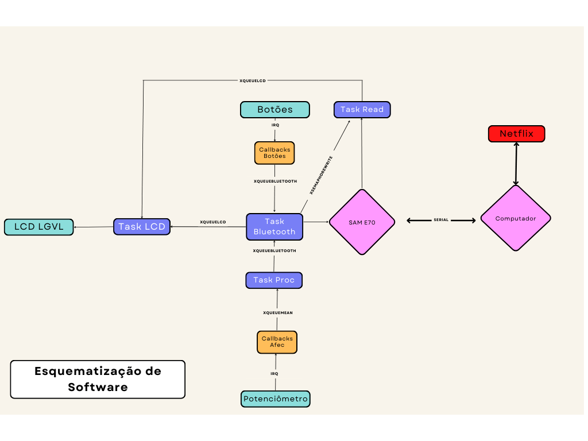

<div align="center" style="max-width:68rem;">


</div>

<div align="center" style="max-width:68rem;">


</div>


### Integrantes

<div align="center" style="max-width:68rem;">
<table>
  <tr>
    <td align="center"><a href="https://github.com/matheus-1618"><br /><sub><b>Matheus Oliveira</b></sub></a><br /><a href="https://github.com/matheus-1618" title="Matheus Silva M. Oliveira"></a> Developer</td>
   <td align="center"><a href="https://github.com/niveaabreu"><br /><sub><b>Nívea de Abreu</b></sub></a><br /><a href="https://github.com/niveaabreu" title="Nívea de Abreu"></a>Developer</td>

  </tr>
</table>
</div>

### Organização de Hardware

Pinos utilizados:

<div align="center" style="max-width:68rem;">

| Função  | PINO  |
|---------|-----------------|
| Voltar 10s  |        PC17         |
| Pause/Play   |        PC30         |c
| Avançar 10s |         PB2      |
| Escolher filme aleatório  |        PA19         |
| On/Off   |        PA4         |
| Volume |         PD30        |
| DISPLAY LVGL |         EXT2        |


</div>
Esquematização de montagem:

<div align="center" style="max-width:68rem;">


</div>

Montagem de protótipo mecânico:

<div align="center" style="max-width:68rem;">


</div>

### Organização de Software
O Software prima por realizar uma conexão confiável e segura entre o microprocessador Uc e o computador na qual deseja-se controlar a aplicação.

<div align="center" style="max-width:68rem;">


</div>


### Para executar o projeto :warning:
Para reproduzir este projeto em sua máquina, além da obtenção de hardware disposto acima, deve-se cumprir as seguintes etapas:
* Para rodar o projeto, execute em um sistema Windows, nativo ou virtualizado;
* Instale o [Atmel Studio](https://www.microchip.com/content/dam/mchp/documents/parked-documents/as-installer-7.0.2542-web.exe)
* Instale o [WebDriver](https://chromedriver.chromium.org/downloads)

*Abra um terminal de comando, digite o caminho onde deseja clonar o repositório e execute:*
```bash

git clone https://github.com/insper-classroom/22b-emb-proj-controlflix/
```

*Entre na pasta /python e execute:*
```bash

python -m pip install -r requirements.txt
```

*Conecte o Módulo Bluetooth MathNivea a seu computador*

*Execute, ainda na pasta python, sabendo sua porta serial Bluetooth (consultar gerenciador de dispostivos)*
```bash

python netflix_controller.py <PORTA> -d
```

*Abra o Atmel Studio e execute sem debbuging para a placa*

Seu ControlFlix já deve estar executando.
### Ideia

##### Desenvolvendo um controle remoto para Netflix

<!--  Descreva aqui em poucas palavras qual a ideia do seu controle. Se ele vai ser de jogo ou de aplicação -->
Nossa ideia consiste na implementação de um controle automatizado para auxiliar no manejo de séries/filmes na plataforma de Streaming **Netflix**. Este controle teria em sua constituição botões que permitiriam pause/play do longa em execução, possibilidade de avanço ou regresso em 10s do longa, controle do volume do dispositivo, e ilustração do volume atual, além do progresso do longa.

### Nome

<!-- De um nome ao seu controle! -->
*ControlFlix*

### Usuários 


O controle é destinado a pessoas que ao utilizarem computadores para visualizarem longas da Netflix (utilizando ou não conexões HDMI com televisões), e queiram um controle prático e eficaz para manejo de operações práticas, como pausar, aumentar o volume, e até conferir de maneira rápida o volume atual e o progresso do longa assistido.


### Software/Jogo 

<!-- Qual software que seu controle vai controlar? -->
Um Browser que esteja no link da plataforma da Netflix.

### Jornada do usuários (3 pts)

<!-- Descreva ao menos duas jornadas de usuários distintos, é para caprichar! -->
**1ª Jornada**:


Um usuário está com seu par, e pretende ver um filme na Netflix em seu computador, mas não gosta do fato de ter que manejar o dispositivo para operações simples como toda hora, pausar ou despausar o longa, ficar controlando o nível do volume, ou até voltar 10s pois perderam um detalhe importante. Dessa forma, eles encontram solução para esse problema quando conhecem o *ControlFlix*, que de fato simplifica o manejo, e deixa o computador apenas como uma tela, simplificando as ações de pausar, aumentar volume, ou de avanço/regresso, além de mostrar o quanto de progresso atual se passou desde o início, e o nível do volume. Desde que este usuário, adquiriu uma unidade do ControlFlix, as sessões de filmes e séries, se tornaram mais orgânicas, visto que as operações de controle da plataforma agora estão a literalmente, 4 botões de distância.

**2ª Jornada**:


Um estudante, em suas horas livres durante intervalo de aulas, gosta de assistir filmes/séries. Todavia, devido ao ótimo sistema de refrigeração do Insper, as salas ficam com temperaturas abaixo dos 20 graus, e isso o faz ficar constantemente com as mãos em seu moletom para as aquece-las. Todavia, ele gosta de ainda assim de assistir seus longas, mas se torna um incoveniente pausar, alterar volume, avançar/regressar o streaming ou até mesmo controlar o volume, visto que ele teria que tirar as mãos de seu casaco para alterar essas opções em seu laptop. 
Dessa maneira, o Controlflix se torna uma solução eficaz para esse usuário, visto que devido a seu tamanho e praticidade, cabe dentro do bolso do moletom, e permite ao estudante a modificação e controle de todas essas configurações, deixando ele com conforto e tranquilidade para continuar assistindo suas séries.

### Comandos/ Feedbacks (2 pts)

**Comandos**:


O três botões digitais serão responsáveis respectivamente por:
- Pausar/dar play no stream, 
- Avançar 10s,
- Regredir 10s. 


O potenciômetro analógico será responsável pelo controle do volume do som. 


**Feedbacks**:


Por fim uma faixa de LED / Tela LCD mostrará o progresso do filme ou o respectivo nível do volume atual.


## In/OUT (3 pts)

- Avanca 10s: Push button verde
- Regressa 10s: Push button vermelho
- Pause/Play: Push button azul
- Controle de volume: Potenciômetro 
- Nível do volume atual/progresso: Tela LCD / Fita de LED

**Entradas Digitais:** 3 botões coloridos


**Entrada Analógica:** Um potenciômetro com motor.


**Saída Digital:** Tela LCD

### Design (2 pts)

<!--
Faca um esboco de como seria esse controle (vai ter uma etapa que terão que detalhar melhor isso).
-->
<div align="center" style="max-width:68rem;">


</div>

@2022, Insper, Quinto Semestre, Engenharia da Computação.